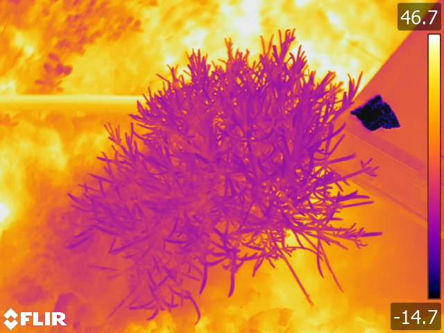
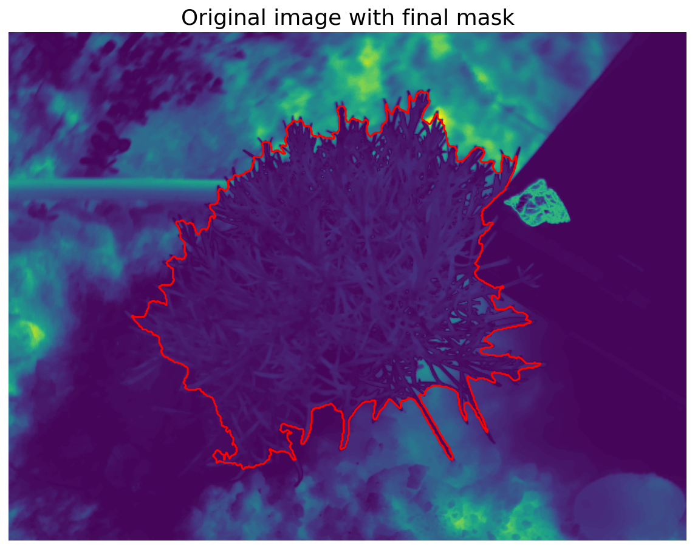

# Two tools for extracting mean plant temperature from thermal images !

- General informations :
  
The flir_image_extractor.py tool comes from this repository : https://github.com/ITVRoC/FlirImageExtractor
It relies on Exiftool to work (https://exiftool.org/).

Segmentation is done using the Segment Anything Model which can be downloaded and installed following : https://github.com/facebookresearch/segment-anything?tab=readme-ov-file
Install the model and its dependencies, as well as download the model checkpoints (link in the same web page).

For both codes to work, the plant of interest must be located in the center of the image!

Here is an example of image both codes can treat:

And here an example of the resulting plant mask obtained using open_segment_thermal.py:

- Tool 1 : Direct segmentation of thermal images (open_segment_thermal.py)

To try a direct segmentation of the thermal image using SAM model. It takes as inputs several positive prompts at the center of the thermal image, and negative prompts in the corners.
For the image on the repository one obtains: Tmean=30.67°C, std deviation: 2.49°C. Computational time on an intel i5 CPU: 80 seconds

- Tool 2 : Obtention of plant location from visible image segmentation (extract_register_segment

When the first solution does not work, one can align the visible and thermal images, segment the plant in the visible image, and apply the resulting mask onto the thermal image.

Image registration is done using Affinder, a napari plugin (plugins->Affinder): https://www.napari-hub.org/plugins/affinder 
It assumes that there is an affine transformation between both images, once you provided at least three points of correspondence between both images (see the tutorial on Affinder website). Once registration is satisfying, simply close the napari viewer to continue with the program by giving the transformation matrix file name (whose name must be provided when lauchning Affinder, see agin their the Affinder tutorial). As an example I attached the matrix 0530.txt that corresponds to the image given in the repository.
A future improvement of the tool could probably be to select manually or automatically several points of correspondences between both images and perform a perspective registration.

The segmentation takes as input a point located at the center of the image (presumed location of the plant of interest).
For the image on the repository one obtains: Tmean=30.68°C, std deviation: 2.56°C. Computational time on an intel i5 CPU: 5-6 minutes depending on how easy it is to manually find the correspondences points at the registration step.

- Usage:

Once all plugins and dependencies are installed, in the files of interst simply specify the path to your image, the name of the output file (csv file containing file name, mean plant temperature and standard deviation), and the path to the SAM model checkpoints and run!
